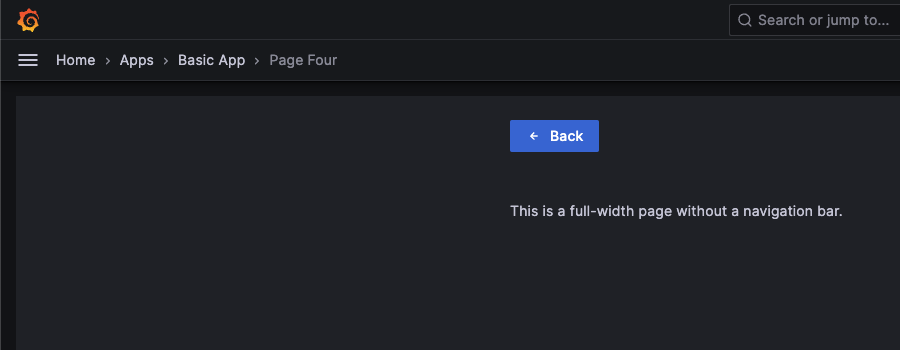

# Basic App Plugin

This example demonstrates how to build a basic app plugin for Grafana that uses custom routing.

- [What are Grafana app plugins?](#what-are-grafana-app-plugins)
- [Guides in this example](#guides-in-this-example)
- [Learn more](#learn-more)

## What are Grafana app plugins?

App plugins can let you create a custom out-of-the-box monitoring experience by custom pages, nested datasources and panel plugins.

---

## Guides in this example
 
|                                                  **Example**                                                        |          **Source**         |
|---------------------------------------------------------------------------------------------------------------------|--------------------------------------|
| [How to enable the tab navigation bar?](#how-to-enable-the-tab-navigation-bar)                                      |   [utils.routing.ts], [constants.ts#L17] |
| [How to add a custom route?](#how-to-add-a-custom-route)                                                            |   [Routes.tsx], [constants.ts#L6]       |
| [How to add a custom route with URL parameters?](#how-to-add-a-custom-route-with-url-parameters)                    |   [Routes.tsx], [PageThree.tsx] |
| [How to create a full-width page with no navigation bar?](#how-to-create-a-full-width-page-with-no-navigation-bar)  |   [utils.routing.ts#L25] |
| [How to add custom styling to your components?](#how-to-add-custom-styling-to-your-components)                      |   [PageFour.tsx] |
| [How to use the Grafana theme in your components?](#how-to-use-the-grafana-theme-in-your-components)                |   [PageFour.tsx#L25] |
| [How to add menu items to the left sidebar?](#how-to-add-menu-items-to-the-left-sidebar)                            |   [plugin.json] |
| [How to add a configuration page to your app?](#how-to-add-a-configuration-page-to-your-app)                        |   [module.ts], [AppConfig.tsx]|
| [How to add custom configuration values to your app?](#how-to-add-custom-configuration-values-to-your-app)          |   [AppConfig.tsx] |
| [How to add configuration options for setting secrets?](#how-to-add-configuration-options-for-setting-secrets)      |   [AppConfig.tsx] |
| [How to update the plugin settings using the API?](#how-to-update-the-plugin-settings-using-the-api)                |   [AppConfig.tsx] |
| [How to access the saved secrets (proxying requests)?](#how-to-access-the-saved-secrets-proxying-requests)          |   [plugin.json] |

### How to enable the tab navigation bar?

**Example:** [utils.routing.ts], [constants.ts#L17]


You can enable the tab navigation bar for your app plugin by passing a "nav-model" the `onNavChanged()` function that is passed in as a prop to your root App component. 
If you don't want to get too much into the details you can just edit `NAVIGATION` object in [constants.ts#L17].

**Setting the tabs in [constants.ts#L17]**

```javascript
// Add navigation items here that you want to appear in the tabs
export const NAVIGATION: Record<string, NavItem> = {
  [ROUTES.One]: {
    id: ROUTES.One,
    text: 'Page One',
    icon: 'database',
    url: `${PLUGIN_BASE_URL}/one`,
  },
  // ...
};
```

---

### How to add a custom route?

**Example:** [Routes.tsx], [constants.ts#L6]

Grafana (and the app plugins are no exception) is using [React Router](https://reactrouter.com/). In order to register a new route based on our examples just add a new route constant in [constants.ts#L6] and use it in the [Routes.tsx].

---

### How to add a custom route with URL parameters?

**Example:** [Routes.tsx], [PageThree.tsx]

In order use URL parameters for any routes just append them to the path in the `<Route>` component.

```javascript
// URL parameters are identified by the colon syntax (":<parameter>")
// The "?" at the end marks the parameter as optional, so React Router will also identify this route if there are no parameters used.
<Route exact path={`${PLUGIN_BASE_URL}/${ROUTES.Three}/:id?`} component={PageThree} />
```

**Retrieving URL parameters:**

```javascript
import { useParams } from 'react-router-dom';

export const MyComponent = () => {
   const { id } = useParams<{ id: string }>();
};
```

---

### How to create a full-width page with no navigation bar?

**Example:** [utils.routing.ts#L25]



In order to hide the tab navigation bar and have access to the full view right to the Grafana sidebar just call the `onNavChanged()` function with an `undefined` (as it is done in [utils.routing.ts#L25]).

**In the current example it is enough to just exclude your route from the `NAVGITAION` object ([constants.ts#L17]), and it will be automatically used as a full-width page.**

---

### How to add custom styling to your components?

**Example:** [PageFour.tsx]

We suggest you to use [Emotion](https://emotion.sh) to style your components, just as in the example above.

[More info on how to use @emotion/css](https://emotion.sh/docs/@emotion/css)

---

### How to use the Grafana theme in your components?

**Example:** [PageFour.tsx#L25]

The easiest way is to use the [`useStyles2()`](https://github.com/grafana/grafana/blob/main/contribute/style-guides/themes.md#usestyles2-hook) hook to access the `GrafanaTheme2` theme object.

[Docs on the Grafana Theme](https://github.com/grafana/grafana/blob/main/contribute/style-guides/themes.md)

---

### How to add menu items to the left sidebar?

**Example:** [plugin.json]

You can define pages that you want to add to the left sidebar menu under the `includes` section of your [plugin.json].


**Structure of a page item:**

```javascript
// plugin.json
{
   "includes": [
      {
         "type": "page",
         // The text of the menu item
         "name": "Page One",
         // The link of the menu item (%PLUGIN_ID% will resolve the id of your plugin at build time)
         "path": "/a/%PLUGIN_ID%",
         // The role who can access this page
         "role": "Admin",
         // This tells Grafana to add this page to the left sidebar
         "addToNav": true,
         "defaultNav": true
      }
   ]
}
```

---

### How to add a configuration page to your app?

**Example:** [module.ts], [AppConfig.tsx]

A configuration page can be used to set custom configuration options that are going to be persisted for your plugin on the backend.
It can also be used to save secrets that are no longer sent down to the client but can be appended to your proxied requests by the backend.

---

### How to add custom configuration values to your app?

**Example:** [AppConfig.tsx]

Add a new form field under your [AppConfig.tsx] and make sure that you are setting it under the `jsonData` object.

The `jsonData` object is an arbitrary object of data that can be persisted for your plugin using the `/api/plugins/${pluginId}/settings` API endpoint.

---

### How to add configuration options for setting secrets?

**Example:** [AppConfig.tsx]

Secrets for plugins are stored in the `secureJsonData` object.
This is an arbitrary object of data, however its value is never going to be sent back to the frontend for security reasons.

---

### How to update the plugin settings using the API?

**Example:** [AppConfig.tsx]

Updating plugin settings can be done by sending a `POST` request to the `/api/plugins/${pluginId}/settings` API endpoint

Example payload:

```javascript
{
   enabled: true,
   pinned: true,
   // Arbitrary object of data for your plugin
   jsonData: {
      apiUrl: state.apiUrl,
      isApiKeySet: true,
   },
   // Arbitrary object of data for plugin secrets
   // (pass `undefined` if you don't want to override existing values)
   secureJsonData: {
      apiKey: state.apiKey,
   }
}
```

---

## Learn more

Below you can find source code for existing app plugins and other related documentation.

- [Grafana Synthetic Monitoring App](https://github.com/grafana/synthetic-monitoring-app)
- [Plugin.json documentation](https://grafana.com/docs/grafana/latest/developers/plugins/metadata/)
- [How to sign a plugin?](https://grafana.com/docs/grafana/latest/developers/plugins/sign-a-plugin/)

[utils.routing.ts]: https://github.com/grafana/grafana-plugin-examples/blob/master/examples/app-basic/src/utils/utils.routing.ts#L29
[Routes.tsx]: https://github.com/grafana/grafana-plugin-examples/blob/master/examples/app-basic/src/components/Routes/Routes.tsx#L17
[PageThree.tsx]: https://github.com/grafana/grafana-plugin-examples/blob/master/examples/app-basic/src/pages/PageThree/PageThree.tsx#L10
[PageFour.tsx]: https://github.com/grafana/grafana-plugin-examples/blob/master/examples/app-basic/src/pages/PageFour/PageFour.tsx#L22
[PageFour.tsx#L25]: https://github.com/grafana/grafana-plugin-examples/blob/master/examples/app-basic/src/pages/PageFour/PageFour.tsx#L25
[utils.routing.ts#L25]: https://github.com/grafana/grafana-plugin-examples/blob/master/examples/app-basic/src/utils/utils.routing.ts#L25
[plugin.json]: https://github.com/grafana/grafana-plugin-examples/blob/master/examples/app-basic/src/plugin.json#L19
[module.ts]: https://github.com/grafana/grafana-plugin-examples/blob/master/examples/app-basic/src/module.ts#L5
[AppConfig.tsx]: https://github.com/grafana/grafana-plugin-examples/blob/master/examples/app-basic/src/components/AppConfig/AppConfig.tsx#L26
[constants.ts#L6]: https://github.com/grafana/grafana-plugin-examples/blob/master/examples/app-basic/src/constants.ts#L6
[constants.ts#L17]: https://github.com/grafana/grafana-plugin-examples/blob/master/examples/app-basic/src/constants.ts#L17
