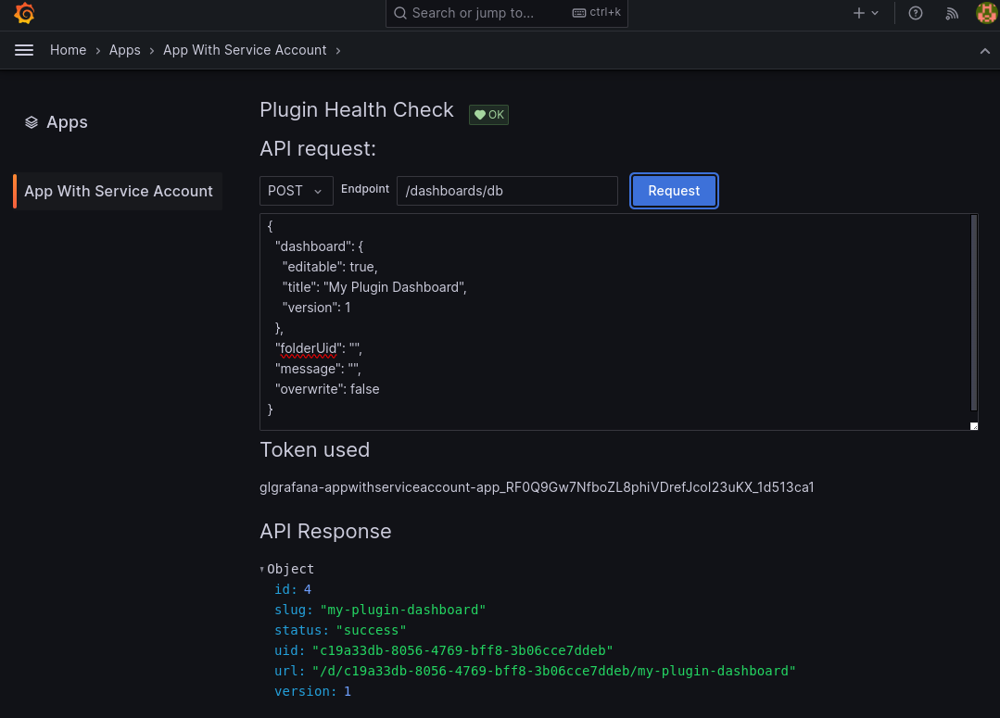
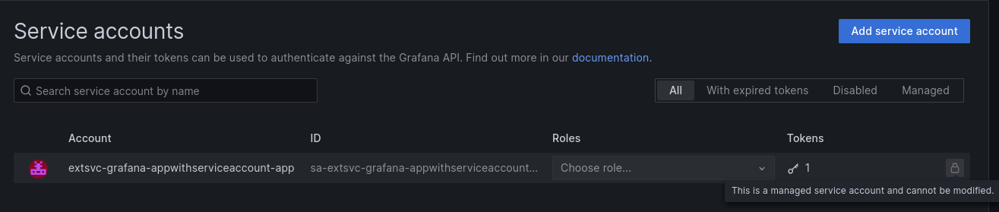

# Grafana App Plugin with Service Account integration example

This plugin is an example of how to integrate Service Account authentication into a Grafana plugin.

**Note:** This plugin requires Grafana 10.3 or later and the `externalServiceAccounts` feature toggle must be enabled. This is an experimental feature.

**Warning:** This feature currently **only supports single-organization deployments**.
The plugin's service account is automatically created in the default organization (ID: `1`). This means the plugin can only access data and resources within that specific organization.
**If your plugin needs to work with multiple organizations, this feature is not suitable.**

## How to use

This app allows you to create a service account in Grafana tailored to your plugin needs. Grafana will provide the plugin with a service account token that you can use to request the Grafana API.



The service account cannot be modified or deleted by users.



## Authentication flow

The plugin uses a [Grafana service account token](https://grafana.com/docs/grafana/latest/administration/service-accounts/#service-account-tokens) to authenticate against the Grafana API. To enable it, add the `iam` section to your `plugin.json` file.

Here is an example to allow the plugin to create dashboards, list or update all dashboards and folders, and list users, teams, and team members:

```json
  "iam": {
    "permissions": [
      { "action": "dashboards:create", "scope": "folders:uid:*" },
      { "action": "dashboards:read", "scope": "folders:uid:*"},
      { "action": "dashboards:write", "scope": "folders:uid:*"},
      { "action": "folders:read", "scope": "folders:uid:*"},
      { "action": "folders:write", "scope": "folders:uid:*"},
      { "action": "org.users:read", "scope": "users:*"},
      { "action": "teams:read", "scope": "teams:*"},
      { "action": "teams.permissions:read", "scope": "teams:*"}
	]
  }
```

The `permission` section defines the set of permissions granted to the plugin's service account.
Refer to the Grafana documentation about [access control](https://grafana.com/docs/grafana/latest/administration/roles-and-permissions/access-control/) for more information.

## Service registration

Once a plugin is registered with an `iam` section, Grafana automatically creates a service account and a token for it. Grafana will then share the service account token with the plugin, using the incoming requests' context:

```go
	// Get the service account token that has been shared with the plugin
	saToken, err := cfg.PluginAppClientSecret()
	if err != nil {
		http.Error(w, err.Error(), http.StatusInternalServerError)
		return
	}
```

The token can be used to request Grafana. Set your HTTP client's `Headers` option to set the `Authorization` header on every outgoing request:

```go
	opts, err := settings.HTTPClientOptions(ctx)
	if err != nil {
		return nil, fmt.Errorf("http client options: %w", err)
	}

	opts.Headers = map[string]string{"Authorization": "Bearer " + app.saToken}

	// Now the client is pre-configured to use the bearer token
	cl, err := httpclient.New(opts)
	if err != nil {
		return nil, fmt.Errorf("httpclient new: %w", err)
	}
```

If for some reason you want to set the HTTP request header on specific requests, here is how:

```go
    ...
    req.Header.Set("Authorization", "Bearer "+token)
```

Check the [app.go](./pkg/plugin/app.go) and [resources.go](./pkg/plugin/resources.go) files for more details about how it's done for this plugin.

## Learn more

Below you can find source code for existing app plugins and other related documentation.

- [Basic app plugin example](https://github.com/grafana/grafana-plugin-examples/tree/master/examples/app-basic#readme)
- [Plugin.json documentation](https://grafana.com/developers/plugin-tools/reference-plugin-json)
- [Sign a plugin](https://grafana.com/developers/plugin-tools/publish-a-plugin/sign-a-plugin)
