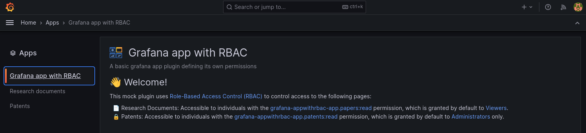

# Grafana App with RBAC example

This template is a starting point for building Grafana app plugins with support for role-based access control (RBAC)



# Overview

This App plugin example shows you how to leverage Grafana RBAC to control accesses to your routes with your own set of roles and permissions.

## Before you begin

Your development environment must meet the following prerequisite:

- Grafana version 10.4.0 or later.
- You must enable RBAC by setting the `accessControlOnCall` feature toggle.

## Plugin usage

Follow these instructions regarding role definitions, protect includes, and other features to use the plugin.

### Define roles

To define roles, add a `roles` section to the `plugin.json` file. Here is an example:

```json
"roles": [
  {
    "role": {
      "name": "Patents Reader",
      "description": "Read patents",
      "permissions": [
        {"action": "grafana-appwithrbac-app.patents:read"}
      ]
    },
    "grants": ["Admin"]
  },
  {
    "role": {
      "name": "Research papers Reader",
      "description": "Read research papers",
      "permissions": [
        {"action": "grafana-appwithrbac-app.papers:read"}
      ]
    },
    "grants": ["Viewer"]
  }
]
```

### Protect includes

To protect your frontend pages behind an action check, add `action` to the include definitions of your `plugin.json` file. For example:

```json
"includes": [
  {
    "type": "page",
    "name": "Research documents",
    "path": "/a/%PLUGIN_ID%/research-docs",
    "action": "grafana-appwithrbac-app.papers:read",
    "addToNav": true,
    "defaultNav": false
  },
  {
    "type": "page",
    "name": "Patents",
    "path": "/a/%PLUGIN_ID%/patents",
    "action": "grafana-appwithrbac-app.patents:read",
    "addToNav": true,
    "defaultNav": false
  }
]
```

### Protect routes

If you want to protect your proxied routes behind an action check, add `reqAction` to the route definitions of your `plugin.json` file. For example:

```json
"routes": [
  {
    "path": "api/external/patents",
    "method": "*",
    "reqAction": "grafana-appwithrbac-app.patents:read",
    "url": "{{ .JsonData.backendUrl }}/api/external/patents",
    "headers": [
      {
        "name": "Authorization",
        "content": "{{ .SecureJsonData.backendApiToken }}"
      }
    ]
  }
]
```

Note that this feature is not demonstrated in this plugin.

### Protect plugin backend resources

If your backend is exposing resources, you can also protect them behind an action check.

To do so, activate two additional features:

- `externalServiceAccounts` - To obtain a managed service account to retrieve Grafana users' permissions.
- `idForwarding` - To obtain an ID token that identify the requester (user or service account).

**Warning:** The `externalServiceAccounts` feature currently **only supports single-organization deployments**.
The plugin's service account is automatically created in the default organization (ID: `1`). This means the plugin can only access data and resources within that specific organization.
**If your plugin needs to work with multiple organizations, this feature is not suitable.**

In your `plugin.json`, add the `iam` section to get a service account token with the needed permissions:

```json
"iam": {
  "permissions": [
    {"action": "users.permissions:read", "scope": "users:*"}
  ]
}
```

You'll need to import our `authlib/authz` library:

```go
import "github.com/grafana/authlib/authz"
```

To instantiate the authorization client, you can retrieve the client secret from the plugin context attached to incoming request.
Given the secret is not changing, we are going to do the instantiation once to leverage the client cache.
Here is a function to get the authorization client:

```go
// GetAuthZClient returns an authz enforcement client configured thanks to the plugin context.
func (a *App) GetAuthZClient(req *http.Request) (authz.EnforcementClient, error) {
	ctx := req.Context()
	ctxLogger := log.DefaultLogger.FromContext(ctx)
	cfg := backend.GrafanaConfigFromContext(ctx)

	saToken, err := cfg.PluginAppClientSecret()
	if err != nil || saToken == "" {
		if err == nil {
			err = errors.New("service account token not found")
		}
		ctxLogger.Error("Service account token not found", "error", err)
		return nil, err
	}

	// Prevent two concurrent calls from updating the client
	a.mx.Lock()
	defer a.mx.Unlock()

	if saToken == a.saToken {
		ctxLogger.Debug("Token unchanged returning existing client")
		return a.authzClient, nil
	}

	grafanaURL, err := cfg.AppURL()
	if err != nil {
		ctxLogger.Error("App URL not found", "error", err)
		return nil, err
	}

	// Initialize the authorization client
	client, err := authz.NewEnforcementClient(authz.Config{
		APIURL: grafanaURL,
		Token:  saToken,
		// Grafana is signing the JWTs on local setups
		JWKsURL: strings.TrimRight(grafanaURL, "/") + "/api/signing-keys/keys",
	},
		// Fetch all the user permission prefixed with grafana-appwithrbac-app
		authz.WithSearchByPrefix("grafana-appwithrbac-app"),
		// Use a cache with a lower expiry time
		authz.WithCache(cache.NewLocalCache(cache.Config{
			Expiry:          10 * time.Second,
			CleanupInterval: 5 * time.Second,
		})),
	)
	if err != nil {
		ctxLogger.Error("Initializing authz client", "error", err)
		return nil, err
	}

	a.saToken = saToken
	a.authzClient = client

	return client, nil
}
```

> Note that the `WithSearchByPrefix` option is specified here to avoid querying the authorization server every time we want to check a different action.<br/>
> The `WithCache` option allows you to override the library's internal cache with you own `or` with different settings. The default expiry time is 5 minutes.

Then you can enforce access control with the client as follows:

```go
func (a *App) HasAccess(req *http.Request, action string) (bool, error) {
	// Retrieve the ID token
	idToken := req.Header.Get("X-Grafana-Id")
	if idToken == "" {
		return false, errors.New("id token not found")
	}

	authzClient, err := a.GetAuthZClient(req)
	if err != nil {
		return false, err
	}

	// Check user access
	hasAccess, err := authzClient.HasAccess(req.Context(), idToken, action)
	if err != nil || !hasAccess {
		return false, err
	}
	return true, nil
}
```

```go
if hasAccess, err := a.HasAccess(req, "grafana-appwithrbac-app.patents:read"); err != nil || !hasAccess {
  if err != nil {
    log.DefaultLogger.FromContext(req.Context()).Error("Error checking access", "error", err)
  }
  http.Error(w, "permission denied", http.StatusForbidden)
  return
}
```

### Perform access control checks in the frontend

To prevent a broken UI, we suggest implementing access control checks on the frontend as well. This means only registering routes and displaying links based on users' permissions.

To perform access control checks, you'll have to import a Grafana core component that's not exported yet.

```ts
// @ts-ignore
import { contextSrv } from 'grafana/app/core/core';
```

Then checks can be performed as follow:

```ts
if (contextSrv.hasPermission('grafana-appwithrbac-app.papers:read')) {
  // Example: register route, display link etc...
}
```

### Assign the role

Assigning roles to specific users requires an [enterprise license](https://grafana.com/docs/grafana/latest/administration/roles-and-permissions/access-control/#role-based-access-control-rbac).

If you have an enterprise license, then you can edit the docker-compose file as follows:

```yaml
environment:
  - GF_ENTERPRISE_LICENSE_TEXT=<your license>
```
